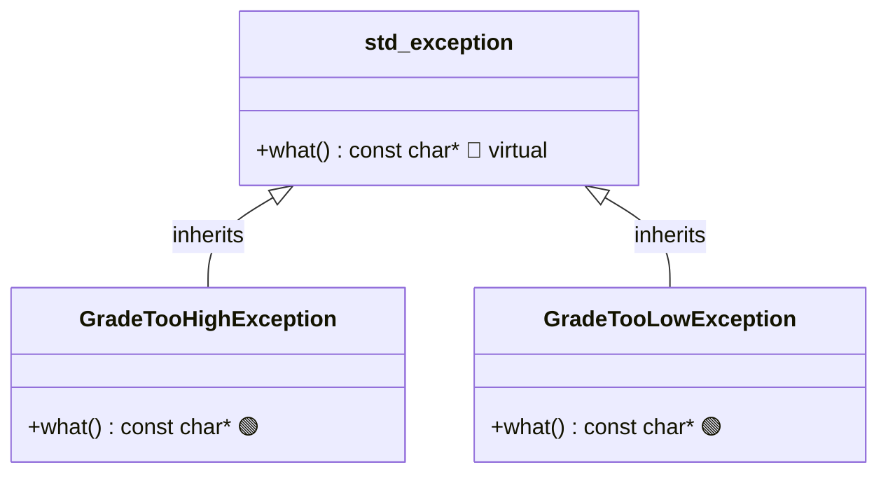

# Index
# Index

- [CPP Reminders](#cpp-reminders)
  - [OCF (Orthodox Canonical Form)](#ocf)
  - [References](#references)
  - [Initializer List](#initializer-list)
  - [Runtime Polymorphism & vtable](#runtime-polymorphism-vtable)
    - [Inheritance (Quick Reminder)](#inheritance-quick-reminder)
    - [The Problem that `virtual` Solves](#the-problem-that-virtual-solves)
    - [The vtable](#the-vtable-what-it-is)
    - [The vptr](#the-vptr-what-it-is)
    - [Pure Virtual & Abstract Classes](#pure-virtual-and-abstract-classes)
    - [Virtual Destructor](#virtual-destructor-why-it-matters)
  - [Inheritance Types](#inheritance-types)

- [Exercise 00](#ex00)
  - [Exceptions](#exceptions)
    - [Why Exceptions](#why-exceptions)
    - [Throw / Unwind / Catch](#what-really-happens-at-low-level)
    - [Inheritance Chain](#inheritance-chain)
    - [Why Inherit from `std::exception`](#why-inherit-from-stdexception)
    - [Catch Order](#catch-order-matters)
    - [`what()` Explained](#what-explained)
    - [Why Nested Classes](#why-nested-classes)
    - [How to Throw & Catch Exceptions](#how-to-throw-and-catch-exceptions)
  - [Common Oral Questions](#questions-typically-asked-for-ex00)
  - [Actual Exercise Implementation](#the-actual-exercise-implementation)

- [Exercise 01](#ex01)
  - [Forward Declaration](#forward-declaration)
  - [Cross-object Exception Flow](#cross-object-exception-flow)
  - [*this — Passing Yourself](#this--passing-yourself)
  - [const Members in Form OCF](#const-members-in-form-ocf)
  - [Common Oral Questions](#questions-typically-asked-for-ex01)

- [Exercise 02](#ex02)
  - [Form → AForm, Abstract Class](#form--aform-abstract-class)
  - [protected action() and the execute() Wrapper](#protected-action-and-the-execute-wrapper)
  - [Wrapper Approach vs Single Function Approach](#wrapper-approach-vs-single-function-approach)
  - [FormNotSignedException](#formnotsignedexception)
  - [The Three Concrete Forms](#the-three-concrete-forms)
    - [Copying a Subclass — Why AForm(other) Matters](#copying-a-subclass--why-aformother-matters)
    - [ShrubberyCreationForm — ofstream, .c_str(), operator bool](#shrubberycreationform--ofstream-cstr-operator-bool)
    - [RobotomyRequestForm — rand, srand, the seeding bug](#robotomyrequestform--rand-srand-the-seeding-bug)
    - [PresidentialPardonForm — the simple case](#presidentialpardonform--the-simple-case)
  - [Bureaucrat's executeForm](#bureaucrats-executeform)
  - [Common Oral Questions](#questions-typically-asked-for-ex02)

- [Exercise 03](#ex03)
  - [Intern Has No State](#intern-has-no-state)
  - [Avoiding if/elseif Chains](#avoiding-ifelseif-chains)
  - [Function Pointers Approach](#function-pointers-approach)
  - [Common Oral Questions](#questions-typically-asked-for-ex03)
# CPP Module 05

## CPP Reminders

### OCF

The orthodox canonical form, is a set of rules and structure for our class, in order to better manage memory, and the way we copy or assign it. and it essentially means having 3 different constructors which **their function is to initialize member variables** and prepare the class, and a destructor to destroy the object and free any allocated memory.

Constructors are essentially invoked (called), when initialization of an object takes place.

these four constructors/destructor must always exist in our class to respect OCF:
```c++
class Object {
	private:
	public:
	Object(); // Default constructor
	Object(const Object& other) // Copy constructor
	Object& operator=(const Object& other); // Copy assignment op
	~Object();
};
```

These declaration are based off, the syntax chosen for these constructors as documented in the [cpp reference](https://cppreference.com/).

- Default Constructor ([as documented here](https://en.cppreference.com/cpp/language/default_constructor)) :
can be called without any arguments, and initializes the class with default values,
default optimization can look something like [this](https://en.cppreference.com/cpp/language/default_initialization).

- Copy Constructor (as documented here) :
is called when the argument is the same type as the class, and is used to copy the \
values from that object without changing or mutating it.\
this is why it is called using a `const`.\
as well as the parameter being passed as a reference `&`, **to avoid calling the copy constructor recursively and causing a stack overflow**, because passing a variable as a parameter to be copied locally will result in that.

-  Copy assignment operator ([as documented here](https://en.cppreference.com/cpp/language/copy_assignment)) :
this method is essentially an overloaded operator `=`, which basically means, changing the behavior of an operator such as `=, +, -, ...`, to act differently when used on our class.

```c++
Object a;
Object b;

b = a;
```

this translates to :

```c++
b.operator=(a); //overloaded operator method.
```

which would be implemented like this :

```c++
Object& Object::operator=(const Object& other)
{
	if (&other != this)
	{
		this->value = other.value;
	}
	return *this;
}
```

okay the reason for returning the object itself, `*this` which is a pointer to the class calling the `operator=` method, is to allow chaining, as assigning it directly and returning `void`, will only copy one thing, not chain.

```c++
a = b = c;
// translates to for the compiler
a.operator=(b.operator=(c));
```

so the c values will get copied into b and return the b object, and b will values will get copied into a and return the a object, and the final object we will be left with is `a`.

and returning `Object&` reference to the b object itself, is just to avoid, calling the copy constructor on return, which is for optimization, and same goes for passing the parameter `const Object& other`.

as for the self-assignment check, `if (&other != this)` this is pretty much just for optimization in simple cases, but when classes own allocated memory, assigning the same object, u would have to delete the old object memory, and copy the same freed memory, causing undefined behavior, crashes, etc...

- Destructor ([as documented here](https://en.cppreference.com/cpp/language/destructor)) :
essentially the destructor, is a special method called at the end of an object's scope or lifetime, its job is to simply clean up or free any allocated resources. `~Object();`

### References

- Reference `&` : Always valid, can't be null, can't be reassigned. Use this 99% of the time in C++98.
- Pointer `*` : Can be null, can be reassigned. Use when you need dynamic memory or optional things.

### Initializer list

is basically a way to assign the member variables before the constructor body, because contrary to common belief, the variables are constructed either way and this is before the constructor body runs anyway.

essentially we follow this rule :

- **Can this member be default-constructed and then assigned?** (`int`, `std::string`, etc.) → An initializer list is still preferred because it avoids an extra assignment.
- **Must this member be initialized immediately?** (`const` members, references, or members with no default constructor) → You **must** use an initializer list.

so for complex objects like `std::string`, the get an empty string and for primitives like `int`..., they get garbage values. ([as documented here](https://en.cppreference.com/cpp/language/constructor))

### Runtime Polymorphism, vtable

#### Inheritance (Quick reminder)

Inheritance is one class **absorbing** everything from another class and being able to extend or modify it.

```cpp
class Animal {
public:
    std::string name;
    void eat() { std::cout << "nom\n"; }
};

class Dog : public Animal {
public:
    void bark() { std::cout << "woof\n"; }
};
```

`Dog` now has `name`, `eat()`, AND `bark()`. It _is_ an Animal — you can use a `Dog` anywhere an `Animal` is expected.

```cpp
Dog d;
d.eat();   // inherited from Animal
d.bark();  // Dog's own
```

The memory layout of a `Dog` object looks like this:

```
┌─────────────────────────┐
│   Animal part           │  ← comes first, always
│     std::string name    │
├─────────────────────────┤
│   Dog part              │
│     (nothing extra here)│
└─────────────────────────┘
```

#### The problem that virtual solves

Let's say you have this:

```cpp
class Animal {
public:
    void speak() { std::cout << "...\n"; }
};

class Dog : public Animal {
public:
    void speak() { std::cout << "woof\n"; }
};

class Cat : public Animal {
public:
    void speak() { std::cout << "meow\n"; }
};
```

Now you do this:

```cpp
Dog d;
Cat c;

Animal& a1 = d;
Animal& a2 = c;

a1.speak(); // what prints?
a2.speak(); // what prints?
```

Without `virtual`, both print `"..."`. The compiler sees `Animal&` and locks in `Animal::speak` at compile time. It doesn't care what the actual object is.

```
Compile time decision:
  a1.speak() → Animal::speak()   ← wrong, we wanted Dog::speak()
  a2.speak() → Animal::speak()   ← wrong, we wanted Cat::speak()
```

This is called **static dispatch**.  the function is resolved at compile time based on the declared type, not the actual object.

Add `virtual` and everything changes:

```cpp
class Animal {
public:
    virtual void speak() { std::cout << "...\n"; }
};
```

Now:

```
a1.speak() → Dog::speak()  → "woof"  ✓
a2.speak() → Cat::speak()  → "meow"  ✓
```

The function is now resolved at **runtime** based on what the object actually is. This is **dynamic dispatch**, or runtime polymorphism.

How does C++ know at runtime what the actual type is? That's the vtable.
####  The vtable, what it is

When a class has at least one `virtual` function, the compiler creates a hidden data structure called the **vtable** (virtual table). It's an array of function pointers, one slot per virtual function. It's created **once per class** at compile time and lives in static memory.

```
Animal vtable:
┌─────────────────────────────┐
│ slot[0] → Animal::speak     │
└─────────────────────────────┘

Dog vtable:
┌─────────────────────────────┐
│ slot[0] → Dog::speak        │  ← overwritten
└─────────────────────────────┘

Cat vtable:
┌─────────────────────────────┐
│ slot[0] → Cat::speak        │  ← overwritten
└─────────────────────────────┘
```

If a subclass doesn't override a virtual function, its vtable slot just copies the parent's pointer.

If you add more virtual functions:

```cpp
class Animal {
public:
    virtual void speak();
    virtual void eat();
    virtual void sleep();
};
```

```
Animal vtable:
┌──────────────────────────┐
│ slot[0] → Animal::speak  │
│ slot[1] → Animal::eat    │
│ slot[2] → Animal::sleep  │
└──────────────────────────┘
```

Each virtual function gets its own slot. The slots are in the same order for every class in the hierarchy, that's what makes the lookup work.

#### The vptr, what it is

Every **object** of a class with virtual functions gets a hidden pointer injected by the compiler called the **vptr** (virtual pointer).

The vptr points to the vtable of the object's **actual** class.

```
Dog d;
Cat c;
```

Memory layout:

```
d (Dog object):
┌─────────────────────────────────────────────┐
│ vptr ───────────────────────────────────────┼──→ Dog vtable
│                                             │      slot[0] → Dog::speak
│ (Animal part: name, etc.)                   │
│ (Dog part: any extra members)               │
└─────────────────────────────────────────────┘

c (Cat object):
┌─────────────────────────────────────────────┐
│ vptr ───────────────────────────────────────┼──→ Cat vtable
│                                             │      slot[0] → Cat::speak
│ (Animal part)                               │
│ (Cat part)                                  │
└─────────────────────────────────────────────┘
```

The vptr is always at the very beginning of the object's memory (on most compilers). It's set in the constructor

What happens at a virtual call

```cpp
Animal& a = d;  // base reference to a Dog
a.speak();
```

The compiler generates roughly this machine code:

```
1. a  is a reference — it points to the Dog object in memory
2. read the first bytes of that object → that's the vptr
3. vptr points to Dog's vtable
4. read slot[0] from Dog's vtable → address of Dog::speak
5. call that address
```

In pseudocode:

```cpp
(*a.vptr[0])(a);  // call whatever slot[0] points to, passing the object
```

This lookup happens **every single call**, at runtime. That's the cost.\
one pointer dereference through the vptr, then one pointer dereference through the vtable slot.

With a non-virtual call:

```
// compiler knows a is Animal, speak() is not virtual
// bakes Animal::speak address directly into the binary
// zero indirection, decided at compile time
```

#### Pure virtual and abstract classes

A **pure virtual** function is declared with `= 0`:

```cpp
class Shape {
public:
    virtual double area() = 0;  // pure virtual
};
```

This means:

- `Shape` has no implementation of `area()`
- `Shape` **cannot be instantiated**, it's now an **abstract class**
- Any class inheriting from `Shape` **must** override `area()` or it's also abstract

```cpp
Shape s;        // ERROR: cannot instantiate abstract class
```

```cpp
class Circle : public Shape {
public:
    double area() { return 3.14 * r * r; }  // must provide this
};

Circle c;  // fine
```

The vtable for an abstract class has a null pointer (or a special abort function) in the pure virtual slot, calling it directly would crash, which is why instantiation is forbidden.

```
Shape vtable:
┌─────────────────────────────┐
│ slot[0] → __cxa_pure_virtual │  ← crashes if called
└─────────────────────────────┘

Circle vtable:
┌─────────────────────────────┐
│ slot[0] → Circle::area      │  ← properly overridden
└─────────────────────────────┘
```

#### Virtual destructor, why it matters

This is the thing that we will look at in ex02 when you have `AForm*` pointers:

```cpp
class Animal {
public:
    ~Animal() { }  // NOT virtual
};

class Dog : public Animal {
public:
    std::string* data;
    Dog() { data = new std::string("woof"); }
    ~Dog() { delete data; }
};

Animal* a = new Dog();
delete a;  // ← calls Animal::~Animal() only, Dog::~Dog() never runs
           // data is never deleted → memory leak
```

If the destructor isn't virtual, `delete` on a base pointer only calls the base destructor. The derived destructor never runs, memory leaks.

Fix :

```cpp
class Animal {
public:
    virtual ~Animal() { }  // virtual destructor
};

delete a;  // now calls Dog::~Dog() then Animal::~Animal()  ✓
```

### Inheritance types

public, protected, private

The syntax for all tree :

```cpp
class Dog : public Animal    // most common
class Dog : protected Animal
class Dog : private Animal
```


| Member in Base     | `public` inheritance | `protected` inheritance | `private` inheritance |
| ------------------ | -------------------- | ----------------------- | --------------------- |
| `public` member    | stays `public`       | becomes `protected`     | becomes `private`     |
| `protected` member | stays `protected`    | stays `protected`       | becomes `private`     |
| `private` member   | inaccessible         | inaccessible            | inaccessible          |

## ex00 :

this exercise will further strengthen our cpp knowledge. 

### Exceptions

first new thing to notice here is exceptions, and they are basically a new way for us to handle errors, without exceptions we we would be checking return values in order to handle failure cases.

let's go over how they work and why is it better in this new manner.
#### Why Exceptions

exceptions are essentially a better way of handling errors.]
##### The old way

before the only way signal an error, is to return a specific integer, and check it on return, but this makes for multiple problems, for one callers might just ignore it, leading to bugs and constructors don't have any way to signal an error, if an error happens during construction.

```cpp
// C style — error codes. Ugly and unsafe.
int createBureaucrat(int grade) {
    if (grade < 1)   return -1;  // error: too high
    if (grade > 150) return -2;  // error: too low
    return 0;  // ok
}

// Caller MUST check every time. But they often don't.
int r = createBureaucrat(0);
if (r == -1) handleTooHigh();
if (r == -2) handleTooLow();
```

also as said  `Constructors have no return value. You cannot signal failure from a constructor using a return code. Exceptions are the only clean solution.`

##### The New (CPP) way

the main helpful thing about this new way, is we abstract how error handle even more, the try block is where stuff happen, and in case of any error "thrown", the execution of that code stops right there and then and we jump to the catch block to handle it however we want, and the constructed objects up to that point get destroyed cleanly as well.

```cpp
try {
    Bureaucrat b("Bob", 0);    // throws GradeTooHighException
    doWork(b);                  // ← never reached
    doMoreWork(b);              // ← never reached
}
catch (std::exception& e) {
    // ONE place handles both error types
    std::cout << e.what() << std::endl;
}
// program continues normally here
```

here instead, `Error handling lives in one place. Normal code stays clean. Constructors can signal failure. Local objects always clean themselves up.`

##### What really happens at low level

Three things really happen when an exception is thrown, let's go through them in detail `Throw / unwind / catch`
###### Throw

when we detect a invalid input or any kind of error, we create an exception object, `inherited from the base exception class`, and throw it.\
execution stops right there.

`ofc you can throw any object even primitives like an int and catch them, just to clarify, but it is irrelevant in our case.`

```cpp
Bureaucrat::Bureaucrat(const std::string& name, int g)
    : name(name) {
    if (g < 1)
        throw GradeTooHighException();  // ← fires here
    if (g > 150)
        throw GradeTooLowException();
    grade = g;  // never reached if throw fires
}
```

Note :

```sh
The object `b` in `main()` is never created. However the sub-objects that _were_ already constructed (like `std::string name` in the initializer list) do get their destructors called — C++ guarantees this.
```

###### Unwind

here stack unwinding occurs if any local variables here are declared or constructed objects, or functions, everything gets popped back from the stack till the caller function, which is `main()`

This is Stack unwinding.

Bureaucrat::Bureaucrat() ------------- **throw fires**
someHelper() ------------- **locals destroyed**
main() ------------- **catch found ✓**

Note : 

```sh
If C++ walks all the way back to the top of `main()` and still finds no matching `catch`, it calls `std::terminate()` and the program crashes with an "unhandled exception" message. Always catch.
```

###### Catch

The exception object is bound to the catch parameter. Normal execution continues after the closing brace of the catch block.

```cpp
try {
    Bureaucrat b("Bob", 0);
}
catch (std::exception& e) {
    // e is really a GradeTooHighException object
    // polymorphism routes what() to the right version
    std::cout << e.what() << std::endl;
    // output: "Grade Is Too High."
}
// ← execution continues here, exception is handled
```

```sh
Notice the `&` in `catch (std::exception& e)`. You **always catch by reference**. Catching by value would "slice" the object — you'd lose the subclass's `what()` override and always get the base class message instead.
```

##### Inheritance chain



in order to use exceptions in our implementation we need to create two classes that inherit from the exception base class.

- The subject explicitly says your exceptions must be catchable as `std::exception&`. Inheriting from it is what makes that possible

###### Why inherit from std::exception ?

by inheriting from the exception base class, we make sure any `catch (std::exception& e)` block can catch any exception that inherits from it,
the reference `e` holds a `GradeTooHighException` object for example, and using the `vptr` it can call the `what` function we overridden, this is runtime dispatch, or runtime polymorphism.

```cpp
// One catch block handles both exception types:
catch (std::exception& e) {
    std::cout << e.what() << std::endl;
    // For GradeTooHighException → "Grade Is Too High."
    // For GradeTooLowException  → "Grade Is Too Low."
}
```

what if we just made our own object class and thrown it without inheriting.

```cpp
struct BadException {};  // no inheritance

try {
    throw BadException{};
}
catch (std::exception& e) {
    // NEVER runs — BadException is not a std::exception
}
// unhandled exception → std::terminate() → crash
```

it won't work because the reference e only holds classes inherited from it.

###### Catch order matters ?

If you have multiple catch blocks, the most specific must come first. C++ tries them top-to-bottom and stops at the first match.

```cpp
try { /* ... */ }
catch (Bureaucrat::GradeTooHighException& e) { // most specific
    std::cout << "too high: " << e.what() << std::endl;
}
catch (Bureaucrat::GradeTooLowException& e) {
    std::cout << "too low: " << e.what() << std::endl;
}
catch (std::exception& e) {  // catches anything else
    std::cout << "unknown: " << e.what() << std::endl;
}
```

```
If you put `std::exception&` first, it swallows everything and the specific blocks below it will never run. The compiler may warn you about unreachable catch blocks.
```

##### What() explained

the `what()` is a virtual method from the `exception` class that we will override and repurpose, it is declared like this

```cpp
  const char* what() const throw();
```


 - Why `const char*` and not `std::string`?

```cpp
what() /* is called _during_ exception handling. If it tried to allocate a */ `std::string` /* on the heap and that allocation failed — it would throw another exception. That's chaos. A string literal is safe because it lives in */ static memory /* for the entire lifetime of the program. No allocation, no risk.*/
```

 - Why the trailing `const`?

It makes `what()` callable on `const` exception objects. In many catch blocks you'll see:

```cpp
catch (const std::exception& e) {  // note: const ref
    e.what();  // only works if what() is marked const
}
```

-  Why `throw()`?

```cpp
It's a C++98 exception specification. The empty parentheses mean "this function is guaranteed not to throw." It also has to match the base class signature exactly to be a proper override:
```

- Note
in c++98 : `what() const throw()`, what we use
in c++11 : `what() const noexcept` same meaning just cleaner syntax, not available in 98.

##### Why nested classes

here it is all about scope, nested classes is a way to use the created class only within the scope of the object it is defined in, not the global scope

it is excepted, because the structure of the exercises 


| Nested ✓ (what we have)                                                                                                                                                                          | Global ✗ (bad idea)                                                                                                                                                     |
| ------------------------------------------------------------------------------------------------------------------------------------------------------------------------------------------------ | ----------------------------------------------------------------------------------------------------------------------------------------------------------------------- |
| Bureaucrat::GradeTooHighException                                                                                                                                                                | GradeTooHighException                                                                                                                                                   |
| Crystal clear ownership. <br>When Form gets its own<br>`GradeTooHighException`<br>in ex01, they peacefully coexist as `Form::GradeTooHighException`<br>and  `Bureaucrat::GradeTooHighException`. | Name collision in ex01. Both Bureaucrat and Form would try to declare <br>`GradeTooHighException` at global scope. One will shadow the other, or the linker will error. |

##### How to throw and catch exceptions

```cpp
// Inside Bureaucrat's own methods — no prefix needed
throw GradeTooHighException();

// From outside the Bureaucrat class
throw Bureaucrat::GradeTooHighException();

// Catching specifically
catch (Bureaucrat::GradeTooHighException& e) { /* ... */ }

// Catching the base — catches BOTH types (recommended)
catch (std::exception& e) { /* ... */ }
```

### Questions Typically asked for ex00

| Question                                                | Answer                                                                                                                                      |
| ------------------------------------------------------- | ------------------------------------------------------------------------------------------------------------------------------------------- |
| What does throw do?                                     | Creates an exception object and jumps to the nearest matching catch, destroying local variables along the way (stack unwinding).            |
| Why catch by reference?                                 | Catching by value slices the object — you lose the subclass's `what()` override. A reference keeps the real type alive.                     |
| Why inherit from std::exception?                        | So the exception is catchable with `catch (std::exception& e)`. Without inheritance, that catch block doesn't match.                        |
| What does the throw() at the end of what() mean?        | C++98 exception specification meaning "this function will not throw". Must match the base class signature exactly for the override to work. |
| Why return const char* and not std::string from what()? | what() is called during exception handling. Allocating a std::string could itself throw. A string literal lives in static memory — safe.    |
| Why are exceptions nested inside Bureaucrat?            | Scoping. Form will also have GradeTooHighException in ex01. Nesting prevents name collisions and shows ownership.                           |
| Why does incrementGrade decrease the number?            | Grade 1 is the highest rank. Incrementing means getting a higher rank, so the integer value decreases.                                      |
| What happens if you don't catch an exception?           | C++ calls std::terminate() which crashes the program.                                                                                       |

#### The Actual Exercise Implementation

let's at least explain what happens really in my code for two tests, one valid and one invalid.

Test 1, Valid construction

```cpp
std::cout << "--- Valid Construction & operator<< ---" << std::endl;
try {
    Bureaucrat b("Alice", 75);
    std::cout << b << "\n";
}
catch (std::exception &e) {
    std::cout << e.what() << std::endl;
}
```

**What actually happens:**

```
1. try block entered — C++ registers a "catch landing pad" for this scope

2. Bureaucrat b("Alice", 75) called
   → initializer list runs first:
       name("Alice")   — std::string constructed, value = "Alice"
   → constructor body runs:
       75 < 1  ? no
       75 > 150? no
       grade = 75      — assigned
   → b is fully constructed on the stack

3. operator<< called:
   → b.getName() returns const std::string& to "Alice" — no copy
   → b.getGrade() returns int 75
   → prints: "Alice, bureaucrat grade 75."

4. try block closes — b goes out of scope
   → b.~Bureaucrat() called — std::string name destroys itself
   → stack frame cleaned up

5. catch block: never entered — no exception was thrown
```

Note 
```
A "catch landing pad" is a specific block of compiler-generated assembly or machine code designed to receive control when an exception is thrown. When you enter a `try` block, the compiler registers this landing pad with the operating system's exception unwinding mechanism.
```

```
Once the runtime finds the stack frame that contains your `try` block, it redirects execution to the "landing pad" associated with that scope
```

 Test 2, Grade too high on construction
 
```cpp
std::cout << "--- Grade Too High on Construction ---" << std::endl;
try {
    Bureaucrat b("Bob", 0);
}
catch (std::exception &e) {
    std::cout << e.what() << std::endl;
}
```

**This is where exceptions get real. Step by step:**

```
1. try block entered — landing pad registered

2. Bureaucrat b("Bob", 0) called
   → initializer list runs:
       name("Bob")  — std::string constructed ✓
   → constructor body runs:
       0 < 1 ? YES
       → throw GradeTooHighException()
```

Right here, several things happen simultaneously:

```
a. GradeTooHighException object is created
   (tiny object, just a vptr pointing to GradeTooHighException vtable)

b. The constructor for Bureaucrat is ABANDONED
   grade = g never runs
   b is never fully constructed
   b never exists as a valid object

c. But name was already constructed in the initializer list
   → name.~std::string() is called — its memory is freed
   C++ guarantees sub-objects already built get destroyed

d. Stack unwinding begins:
   C++ walks up the call stack looking for a matching catch

   Call stack at this moment:
   #0  Bureaucrat::Bureaucrat("Bob", 0)    ← throw fired here
   #1  main()                              ← catch lives here

e. C++ reaches main(), checks: does catch(std::exception& e) match
   GradeTooHighException?

   → GradeTooHighException inherits from std::exception
   → YES, it matches

3. catch block entered:
   e is bound to the GradeTooHighException object
   e is typed as std::exception& but the actual object is GradeTooHighException

4. e.what() called:
   → e is std::exception& but what() is virtual
   → CPU reads e's vptr
   → vptr points to GradeTooHighException's vtable
   → vtable slot[0] → GradeTooHighException::what
   → returns "Grade Is Too High."
   → prints: "Grade Is Too High."

5. catch block exits
   GradeTooHighException object is destroyed

6. execution continues after the catch block — program doesn't crash
```

Key thing to lock in: **`b` never exists**. You can't use it after the try block because it was never constructed. The stack has no `b` object on it. The only thing that got constructed and then destroyed was the `std::string name` inside the initializer list.
## ex01 :

this exercise builds directly on ex00, the new concepts introduced here are :

- **Forward Declaration**, solving the circular include problem between Bureaucrat and Form
- **Cross-object exception flow**, Form throws, Bureaucrat catches, exception crosses class boundaries
- **`*this`**, passing the current object to another class's method

### Forward Declaration

Bureaucrat needs Form (to call `form.beSigned()`), Form needs Bureaucrat (to call `b.getGrade()`).  
If both headers include each other → infinite include loop → compiler error.

The fix: in `Form.hpp`, instead of including Bureaucrat, just declare it exists:

```cpp
class Bureaucrat;   // forward declaration — "trust me, this class exists"

class Form {
    void beSigned(const Bureaucrat& b);  // reference/pointer is fine with fwd decl
};
```

Then in `Form.cpp`, include the full header because that's where you actually call `b.getGrade()`:

```cpp
#include "Bureaucrat.hpp"  // full definition needed — we call methods on it

void Form::beSigned(const Bureaucrat& b) {
    if (b.getGrade() <= reqGrade)  // ← needs full Bureaucrat definition
        isSigned = true;
}
```

The rule :

| Situation                                         | Forward decl enough? |
| ------------------------------------------------- | -------------------- |
| `const Bureaucrat&` or `Bureaucrat*` as parameter | Yes ✓                |
| Calling a method `b.getGrade()`                   | No — full include    |
| Accessing a member                                | No — full include    |
| Inheriting from it                                | No — full include    |

### Cross-object exception flow

In ex00, throw and catch always lived in the same scope.  
In ex01, `Form::beSigned` throws and `Bureaucrat::signForm` catches — two different classes.

```
b.signForm(f)
  └─► form.beSigned(*this)
        └─► 100 <= 50 ? NO → throw Form::GradeTooLowException()
              │
              ◄── caught inside signForm's catch block
                  prints: "Bob couldn't sign TaxForm because Form Grade Is Too Low."
                  signForm returns normally

main's outer catch → NEVER FIRES, signForm already handled it
```

The exception propagates up the call stack automatically — no return value plumbing between the two classes needed.

### \*this, passing yourself

`this` inside any method is a hidden pointer to the current object.  
`*this` dereferences it — giving you the object itself to pass as a reference.

```cpp
void Bureaucrat::signForm(Form& form) {
    form.beSigned(*this);  // pass the current Bureaucrat as const Bureaucrat&
}
```

`beSigned` takes `const Bureaucrat&` — so you dereference `this` to match. No copy made.

### const members in Form OCF

Form has `const int reqGrade`, `const int execGrade`, `const std::string name`.  
These are locked after construction — only settable in the initializer list.

```cpp
// copy constructor — all const members set in initializer list, only chance
Form::Form(const Form& other)
    : name(other.name), isSigned(other.isSigned),
      reqGrade(other.reqGrade), execGrade(other.execGrade) {}

// copy assignment — can ONLY copy isSigned, the rest are const
Form& Form::operator=(const Form& other) {
    if (this != &other)
        this->isSigned = other.isSigned;
    return *this;
}
```

### Questions typically asked for ex01

| Question                                                  | Answer                                                                                                                                                 |
| --------------------------------------------------------- | ------------------------------------------------------------------------------------------------------------------------------------------------------ |
| Why forward declaration in Form.hpp?                      | To break the circular include — both headers including each other loops forever. Forward decl tells compiler "this class exists" without including it. |
| When is forward declaration enough?                       | References and pointers. Need full include when calling methods, accessing members, inheriting, or creating by value.                                  |
| Why does signForm take `Form&` not `const Form&`?         | Because beSigned might set `isSigned = true` — that modifies Form. const would prevent it.                                                             |
| Why does beSigned take `const Bureaucrat&`?               | Reference = no copy. const = we promise not to modify the Bureaucrat that's signing.                                                                   |
| What does `*this` mean in signForm?                       | `this` is a `Bureaucrat*` pointer to the current object. `*this` dereferences it to pass the object itself as a reference.                             |
| Where is the exception caught in the failed signing test? | Inside `Bureaucrat::signForm`, not in main. signForm handles it and prints the failure message. main's outer catch never fires.                        |
| Why can operator= only copy isSigned?                     | name, reqGrade, execGrade are const — locked after construction. Only mutable members can be assigned.                                                 |

## ex02 :

this exercise turns the base Form into something you actually can't instantiate directly, and adds three classes that DO something concrete. the new concepts here are:

- **Abstract classes and pure virtual functions**, `= 0` makes a function have no body and makes the whole class impossible to create directly
- **The execute() / action() split**, guards live once in the base, each subclass only writes what makes it unique
- **A third exception**, FormNotSignedException
- **File I/O**, std::ofstream, .c_str(), operator bool
- **Randomness**, std::rand, std::srand, and a subtle bug around seeding

### Form → AForm, abstract class

subject says rename Form to AForm and make it abstract. an abstract class is one you can never create an instance of directly, C++ enforces this the moment you give it a pure virtual function:

```cpp
virtual void action() const = 0;
```

that `= 0` means: no implementation here, AForm doesn't know how to "act", only the concrete children do. because of this, AForm becomes abstract automatically, you literally cannot write `AForm a;` anywhere, compiler error.

attributes (name, isSigned, reqGrade, execGrade) all stay private, exactly like Form in ex01, subject explicitly says "attributes need to remain private and belong to the base class."

### protected action() and the execute() wrapper

```cpp
protected:
    virtual void action() const = 0;

public:
    void execute(Bureaucrat const& executor) const;
```

`execute()` is the one function every form shares, it's NOT virtual on purpose, it does the two checks the subject asks for:

```cpp
void AForm::execute(Bureaucrat const& executor) const
{
    if (!this->getSignature())
        throw AForm::FormNotSignedException();
    if (executor.getGrade() > this->getExecGrade())
        throw AForm::GradeTooLowException();
    this->action(); // ← vtable dispatch happens here
}
```

subject: *"You must check that the form is signed and that the grade of the bureaucrat attempting to execute the form is high enough."* that's these two ifs, written once, in the base.

`action()` is the actual behavior, pure virtual, each subclass fills it in. calling `this->action()` from inside execute() goes through the vtable, at runtime it calls whichever subclass's version matches the real object.

why is `action()` protected and not public? honestly it doesn't matter, plenty of people (including friends) put it public and it's still correct. the idea is external code should call execute() not action() directly, but subject never enforces this, don't stress over it.

### wrapper approach vs single function approach

subject literally says: *"Whether you check the requirements in every concrete class or in the base class... is up to you. However, one way is more elegant than the other."*

two ways to do this:

- **wrapper (what we did)**: base has a real `execute()` with guards, subclasses only implement `action()`. guards written ONCE.
- **single function**: `execute()` itself is pure virtual, every subclass repeats the two guard checks inside their own `execute()`. guards repeated 3 times.

both compile, both pass, both are accepted at 42. the subject is hinting at the wrapper approach being the "elegant" one, less duplication, if you ever need to change the guard logic you change it in one place instead of three.

### FormNotSignedException

new exception, third one alongside GradeTooHighException / GradeTooLowException. thrown when execute() is called on a form nobody signed yet.

```cpp
class FormNotSignedException : public std::exception {
    public:
    const char* what() const throw();
};
```

same pattern as the other two, same reasoning, `const char*` return (no heap allocation risk), `const throw()` to match std::exception's signature exactly.

### virtual ~AForm()

any class you'll delete through a base pointer needs a virtual destructor, or only the base part gets cleaned up.

```cpp
AForm* ptr = new ShrubberyCreationForm("home");
delete ptr;
// WITHOUT virtual: only AForm::~AForm() runs, target string never destroyed properly
// WITH virtual: ShrubberyCreationForm::~ShrubberyCreationForm() runs FIRST, then AForm::~AForm()
```

subject doesn't say this explicitly, but you need it because ex03's `makeForm()` returns `AForm*` pointing at concrete objects, and you `delete` them through that base pointer.

### the three concrete forms

| Class | sign grade | exec grade | what it does |
|---|---|---|---|
| ShrubberyCreationForm | 145 | 137 | writes ascii tree to `<target>_shrubbery` file |
| RobotomyRequestForm | 72 | 45 | drilling noise + 50% success/fail |
| PresidentialPardonForm | 25 | 5 | prints pardon message |

lower grade number = higher rank needed, so Pardon needing grade 5 means only near-top bureaucrats can execute it. the numbers going 145→72→25 for sign, and 137→45→5 for exec, are the subject's own joke, planting shrubbery is trivial, pardoning someone is a huge deal.

all three follow the exact same constructor shape:

```cpp
ShrubberyCreationForm::ShrubberyCreationForm(const std::string& target)
    : AForm("ShrubberyCreationForm", 145, 137), target(target) {}
```

`AForm(...)` sets up the four base members (and validates the grades, though here they're hardcoded so it never actually fails). `target(target)` sets the subclass's own member.

#### copying a subclass, why AForm(other) matters

```cpp
ShrubberyCreationForm::ShrubberyCreationForm(const ShrubberyCreationForm& other)
    : AForm(other), target(other.target) {}
```

`AForm`'s four members are private, ShrubberyCreationForm literally cannot touch them directly, not even to copy them. the ONLY code allowed to copy them is AForm's own copy constructor. so you call `AForm(other)` explicitly. skip this and the base part gets DEFAULT constructed instead of copied, name becomes "AForm" instead of the real name, silently broken.

same story for operator=:

```cpp
ShrubberyCreationForm& ShrubberyCreationForm::operator=(const ShrubberyCreationForm& other)
{
    if (this != &other)
    {
        AForm::operator=(other); // only copies isSigned, the rest is const
        this->target = other.target;
    }
    return *this;
}
```

remember, AForm's `operator=` only touches `isSigned`, because name/reqGrade/execGrade are const and locked forever after construction.

#### ShrubberyCreationForm, ofstream, .c_str(), operator bool

```cpp
void ShrubberyCreationForm::action() const
{
    std::ofstream file((target + "_shrubbery").c_str());
    if (!file)
    {
        std::cerr << "Error: could not create shrubbery file\n";
        return ;
    }
    file << "..." << "\n";
    file.close();
}
```

- `.c_str()` needed because in C++98, `ofstream`'s constructor only takes `const char*`, not `std::string` directly (C++11 allows std::string, we're on 98).
- `if (!file)` uses `operator bool()`, an overloaded operator exactly like operator= or operator+, just applied to bool. it checks internal flags (failbit/badbit) that get set if the file couldn't be opened. `!file` calls that operator, negates it, `true` means something went wrong.
- under the hood ofstream wraps the same OS mechanism as C's `open()`/`write()`/`close()`, but wraps the file descriptor + buffer + error state into one object, and closes automatically via RAII when it goes out of scope (destructor), even if an exception happens mid function.

#### RobotomyRequestForm, rand, srand, the seeding bug

```cpp
void RobotomyRequestForm::action() const
{
    std::srand(std::time(0));
    std::cout << "BZZZT DRRRR VRRRMMM KACHUNK\n";
    if (std::rand() % 2)
        std::cout << target << " has been robotomized successfully!\n";
    else
        std::cout << target << " robotomy failed.\n";
}
```

- `#include <cstdlib>` / `#include <ctime>` are required even with `std::`, because the namespace doesn't declare anything by itself, the header is what puts `rand`/`srand`/`time` inside the `std` box in the first place.
- `std::rand()` is pseudo-random, a deterministic formula chained off an internal "state". `std::srand(seed)` sets that starting state. same seed = same sequence, always.
- `std::time(0)` = seconds since 1970, used as the seed so different program RUNS get different sequences.
- `% 2` reduces the huge rand() number down to just 0 or 1, odd/even, roughly a coin flip.

**the bug (kept on purpose, my choice):** `srand` is called INSIDE `action()`, every single call reseeds. `time(0)` only has 1-second resolution, so two robotomies happening in the same second get the exact same seed → exact same result. the "textbook correct" fix is seeding once in `main()` and never touching srand again inside action(). i chose to keep it as is and just test across separate program runs instead.

#### PresidentialPardonForm, the simple case

```cpp
void PresidentialPardonForm::action() const
{
    std::cout << target << " has been pardoned by Zaphod Beeblebrox.\n";
}
```

no file, no randomness, just a print. this is the class that shows the whole POINT of execute()/action(), by the time action() runs, execute() already guaranteed the form is signed and the grade is high enough, action() doesn't need to check anything, it just does its one job.

### Bureaucrat's executeForm

```cpp
void Bureaucrat::executeForm(AForm const& form) const
{
    try
    {
        form.execute(*this);
        std::cout << this->getName() << " executed " << form.getName() << "\n";
    }
    catch (std::exception& e)
    {
        std::cout << this->getName() << " couldn't execute " << form.getName()
                  << " because " << e.what() << "\n";
    }
}
```

exact same shape as signForm from ex01, try the operation, catch anything that inherits from std::exception, print success or the reason for failure. `*this` inside a const method is `const Bureaucrat&`, matching what `execute(Bureaucrat const&)` expects.

### Questions typically asked for ex02

| Question | Answer |
|---|---|
| Why is AForm abstract? | Because action() is declared `= 0`, a pure virtual function with no body. Any class with at least one pure virtual function can't be instantiated. |
| Why is execute() not virtual? | So subclasses can't bypass the guard checks. It's the same function for every form, only action() varies. |
| Why does execute() call action() instead of doing everything itself? | action() is what's actually different per form (file write, drilling, print). execute() is what's always the same (the two checks). |
| Why virtual destructor on AForm? | Deleting a subclass object through an AForm* pointer needs the subclass's destructor to run too, not just the base one. |
| Why AForm(other) in every subclass's copy constructor? | AForm's members are private, subclasses can't copy them directly, only AForm's own copy constructor can. |
| Why .c_str() in ShrubberyCreationForm? | C++98's ofstream constructor only accepts const char*, not std::string. |
| Why re-include cstdlib/ctime even though we already know rand exists? | Namespaces don't declare anything, headers do. std::rand doesn't exist in the std:: box until the header puts it there. |

## ex03 :

this exercise is much smaller, one new class, Intern, whose entire job is to build the right form object from a plain string name, without writing an if/elseif chain (subject explicitly forbids this).

### Intern has no state

subject: *"The intern has no name, no grade, and no unique characteristics."* this means Intern should NOT store anything, no member variables at all besides what OCF requires. every call to makeForm() is independent, nothing remembered between calls.

```cpp
class Intern {
    public:
    Intern();
    Intern(const Intern& other);
    Intern& operator=(const Intern& other);
    ~Intern();

    AForm* makeForm(const std::string& formName, const std::string& target) const;
};
```

empty class basically, just the one method that matters.

### avoiding if/elseif chains

subject: *"You must avoid unreadable and messy solutions, such as using an excessive if/elseif/else structure."*

the trick is a **parallel array lookup**, one array of names, one array of "things to do when that name matches", searched with a plain loop instead of a chain of ifs:

```cpp
const std::string formNames[3] = {
    "shrubbery creation",
    "robotomy request",
    "presidential pardon"
};
```

these exact strings come straight from the subject's own example:
```cpp
rrf = someRandomIntern.makeForm("robotomy request", "Bender");
```
lowercase, space separated, NOT the class name (`RobotomyRequestForm`). matching against the wrong string format silently breaks the subject's own worked example.

### function pointers approach

```cpp
static AForm* createShrubbery(const std::string& target)
{
    return new ShrubberyCreationForm(target);
}
static AForm* createRobotomy(const std::string& target)
{
    return new RobotomyRequestForm(target);
}
static AForm* createPardon(const std::string& target)
{
    return new PresidentialPardonForm(target);
}
```

three tiny helper functions, one per concrete class, each just builds and returns that one form. marked `static` at file scope, meaning internal linkage, only visible inside Intern.cpp, nobody else can call them, keeps them as an implementation detail (same idea as making something private, but for free functions).

```cpp
AForm* (*creators[3])(const std::string&) = {
    createShrubbery,
    createRobotomy,
    createPardon
};
```

read right to left: `creators[3]` is an array of 3 things, `(*creators[3])` means those things are pointers, the whole line means "pointers to functions taking a const string& and returning AForm*". a bare function name like `createShrubbery` automatically decays into its own address, no `&` needed.

```cpp
for (int i = 0; i < 3; i++)
{
    if (formNames[i] == formName)
    {
        AForm* form = creators[i](target);
        std::cout << "Intern creates " << form->getName() << "\n";
        return (form);
    }
}
std::cout << "Intern couldn't find a form named \"" << formName << "\"\n";
return (NULL);
```

two arrays, same index meaning, `formNames[1]` and `creators[1]` are "the robotomy pair". loop walks both in lockstep, the moment index `i` matches the searched name, `creators[i]` is guaranteed to be the matching function. calling `creators[i](target)` through the pointer works exactly like calling that function directly by name.

if nothing matches, loop finishes without returning, falls through to the error message and `NULL`.

`form->getName()` reads AForm's own private `name` (set inside the concrete constructor), so the printed name always matches the real object, not just an echo of whatever string was searched for.

there's also a simpler version of this using a plain `switch(index)` instead of function pointers, does the exact same job, fewer moving parts, easier to explain live without needing to describe pointer-to-function syntax. either is accepted, this is just a style choice.

### memory ownership in main

```cpp
AForm* form = intern.makeForm(names[i], "Bender");
if (form)
{
    b.signForm(*form);
    b.executeForm(*form);
    delete form;
}
```

makeForm returns a heap pointer (`new` was called inside the helper functions), caller is responsible for `delete`ing it. `if (form)` guards against the `NULL` case (unknown form name), never delete a null pointer path that never allocated anything. this is also exactly why AForm needed the virtual destructor from ex02, `delete form` here goes through an `AForm*` pointing at a concrete subclass object.

### Questions typically asked for ex03

| Question                                                                 | Answer                                                                                                                                                    |
| ------------------------------------------------------------------------ | --------------------------------------------------------------------------------------------------------------------------------------------------------- |
| Why doesn't Intern store the form name or target as members?             | Subject says Intern has "no unique characteristics", it should be stateless, each makeForm() call is self-contained.                                      |
| Why avoid if/elseif here specifically?                                   | Subject explicitly forbids it for this exercise, an array + loop (or switch) scales cleanly if more form types get added later.                           |
| Why static on the helper functions?                                      | Internal linkage, keeps them private to Intern.cpp, nothing outside this file should call them directly.                                                  |
| Why does makeForm return NULL on failure instead of throwing?            | Subject says "print an explicit error message", not throw an exception, so NULL + a printed message is what's asked for.                                  |
| Who deletes the form makeForm() returns?                                 | The caller (main, or whoever called makeForm), makeForm only creates it with new, ownership passes to whoever received the pointer.                       |
| Why does AForm need a virtual destructor for this exercise specifically? | Because objects are deleted through an AForm* pointer here, without virtual, only AForm's own destructor would run, leaking the subclass's target string. |